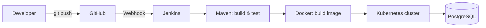
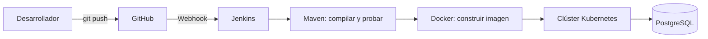

# java-devops-pipeline


**[English](#english) | [Español](#español)**

---

## English

> End-to-end DevOps project: a Spring Boot REST API with a multi-stage Docker build, a Jenkins CI/CD pipeline and deployment to Kubernetes.

### Overview

This project demonstrates the full software delivery lifecycle: from a `git push` to a running application inside a Kubernetes cluster, with no manual steps in between.

### Architecture



### Tech Stack

| Layer            | Technology                     |
|------------------|--------------------------------|
| Language         | Java 21                        |
| Framework        | Spring Boot                    |
| Build tool       | Maven                          |
| Testing          | JUnit 5                        |
| Database         | PostgreSQL                     |
| Containerization | Docker, Docker Compose         |
| CI/CD            | Jenkins (Declarative Pipeline) |
| Orchestration    | Kubernetes (Minikube)          |

### Project Structure

```
.
├── src/                  # Spring Boot application
├── k8s/
│   ├── deployment.yaml   # Kubernetes Deployment
│   └── service.yaml      # Kubernetes Service
├── Dockerfile            # Multi-stage build (Maven -> JRE)
├── docker-compose.yml    # API + PostgreSQL for local development
├── Jenkinsfile           # CI/CD pipeline definition
└── pom.xml
```

### Getting Started

**Prerequisites**

- Java 21+
- Maven 4.1.1
- Docker and Docker Compose
- Minikube (or Kind) and `kubectl`

**Run locally with Maven**

```bash
mvn spring-boot:run
```

**Run tests**

```bash
mvn test
```

**Run with Docker Compose**

```bash
docker compose up --build
```

The API will be available at `http://localhost:8080`.

**Deploy to Kubernetes**

```bash
minikube start
kubectl apply -f k8s/
kubectl get pods
minikube service <service-name> --url
```

### API Endpoints

| Method | Endpoint               | Description |
|--------|------------------------|-------------|
| GET    | `/api/<resource>`      | List all    |
| GET    | `/api/<resource>/{id}` | Get by id   |
| POST   | `/api/<resource>`      | Create      |
| PUT    | `/api/<resource>/{id}` | Update      |
| DELETE | `/api/<resource>/{id}` | Delete      |

### Dockerfile

The image uses a **multi-stage build**: Maven compiles the project in the first stage, and only the resulting JAR is copied into a lightweight JRE image, keeping the final image small.

### CI/CD Pipeline

The `Jenkinsfile` defines a Declarative Pipeline with these stages:

1. **Checkout**: clones the repository.
2. **Build & Test**: `mvn clean verify`.
3. **Docker Build**: builds the application image.
4. **Deploy**: applies the manifests to the Kubernetes cluster.

The pipeline is triggered automatically by a GitHub webhook on every push.


### What I Learned

- Containerizing a Java application with multi-stage builds.
- Orchestrating services locally with Docker Compose.
- Automating build, test and deploy with Jenkins.
- Deploying and exposing applications on Kubernetes.

### Author

**<Your Name>**
[LinkedIn](<your-linkedin-url>) · [GitHub](https://github.com/<your-user>)

[Back to top](#java-devops-pipeline)

---

## Español

> Proyecto DevOps de punta a punta: una API REST con Spring Boot, build multi-etapa con Docker, pipeline CI/CD en Jenkins y despliegue en Kubernetes.

### Descripción

Este proyecto demuestra el ciclo completo de entrega de software: desde un `git push` hasta una aplicación corriendo dentro de un clúster de Kubernetes, sin pasos manuales en el medio.

### Arquitectura



### Tecnologías

| Capa             | Tecnología                     |
|------------------|--------------------------------|
| Lenguaje         | Java 21                        |
| Framework        | Spring Boot                    |
| Build            | Maven                          |
| Pruebas          | JUnit 5                        |
| Base de datos    | PostgreSQL                     |
| Contenedores     | Docker, Docker Compose         |
| CI/CD            | Jenkins (Declarative Pipeline) |
| Orquestación     | Kubernetes (Minikube)          |

### Estructura del proyecto

```
.
├── src/                  # Aplicación Spring Boot
├── k8s/
│   ├── deployment.yaml   # Deployment de Kubernetes
│   └── service.yaml      # Service de Kubernetes
├── Dockerfile            # Build multi-etapa (Maven -> JRE)
├── docker-compose.yml    # API + PostgreSQL para desarrollo local
├── Jenkinsfile           # Definición del pipeline CI/CD
└── pom.xml
```

### Primeros pasos

**Requisitos previos**

- Java 21
- Maven 4.1.1+
- Docker y Docker Compose
- Minikube (o Kind) y `kubectl`

**Ejecutar localmente con Maven**

```bash
mvn spring-boot:run
```

**Ejecutar las pruebas**

```bash
mvn test
```

**Ejecutar con Docker Compose**

```bash
docker compose up --build
```

La API quedará disponible en `http://localhost:8080`.

**Desplegar en Kubernetes**

```bash
minikube start
kubectl apply -f k8s/
kubectl get pods
minikube service <nombre-del-service> --url
```

### Endpoints de la API

| Método | Endpoint               | Descripción       |
|--------|------------------------|-------------------|
| GET    | `/api/<recurso>`       | Listar todos      |
| GET    | `/api/<recurso>/{id}`  | Obtener por id    |
| POST   | `/api/<recurso>`       | Crear             |
| PUT    | `/api/<recurso>/{id}`  | Actualizar        |
| DELETE | `/api/<recurso>/{id}`  | Eliminar          |

### Dockerfile

La imagen usa un **build multi-etapa**: Maven compila el proyecto en la primera etapa y solo el JAR resultante se copia a una imagen JRE ligera, lo que mantiene la imagen final pequeña.

### Pipeline CI/CD

El `Jenkinsfile` define un Declarative Pipeline con estas etapas:

1. **Checkout**: clona el repositorio.
2. **Build & Test**: `mvn clean verify`.
3. **Docker Build**: construye la imagen de la aplicación.
4. **Deploy**: aplica los manifiestos en el clúster de Kubernetes.

El pipeline se dispara automáticamente con un webhook de GitHub en cada push.


### Lo que aprendí

- Contenerizar una aplicación Java con builds multi-etapa.
- Orquestar servicios localmente con Docker Compose.
- Automatizar compilación, pruebas y despliegue con Jenkins.
- Desplegar y exponer aplicaciones en Kubernetes.

### Autor

**Juan Sebastian Lopez Hernandez**

[LinkedIn](https://www.linkedin.com/in/sebasti%C3%A1n-l%C3%B3pez-304179282/) · [GitHub](https://github.com/SebasDevOne)

[Volver arriba](#java-devops-pipeline)